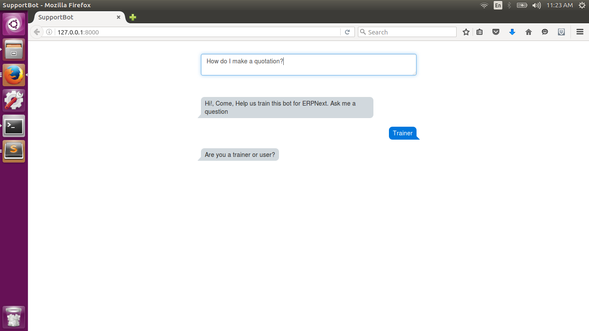
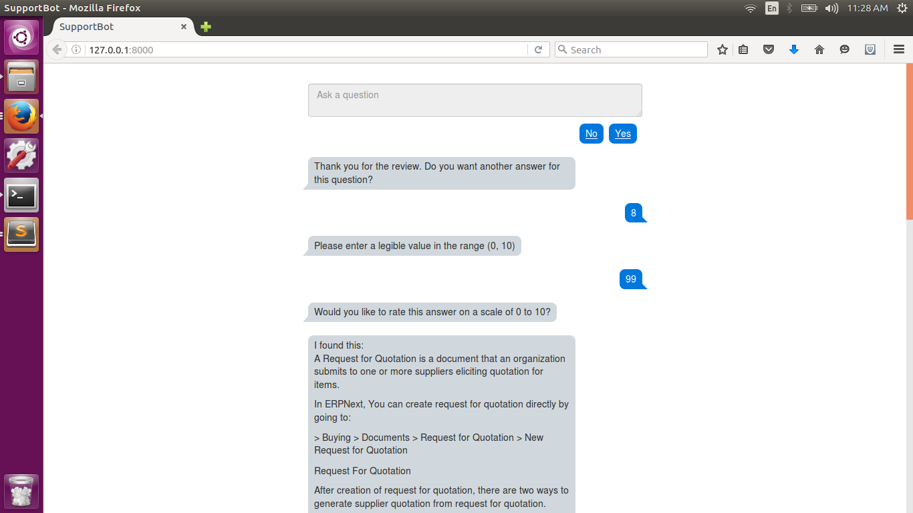
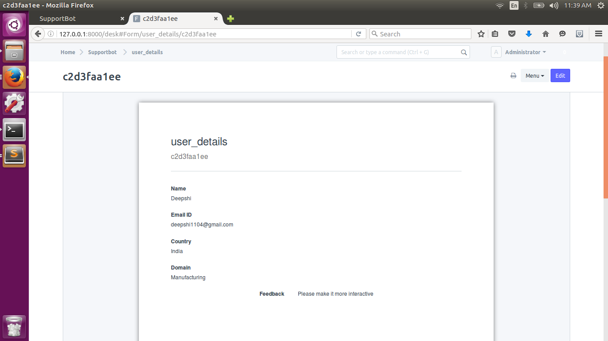

# Supportbot

`This is an internship project from my undergraduation. It does not exhibit my current programming skills`

## Objective

We wanted a script, which, on getting a query could return a perfect answer. We constructed a database using the posts of the [Discussion Forum](https://discuss.erpnext.com) of [ERPNext](https://erpnext.com/) and the [Documentation](http://frappe.github.io/frappe/user/en/) for [Frappe](https://frappe.io/). Whenever a user searches for a query, the bot should return a list of best suited posts from this database ranked in order of their suitability. This suitability (or fitness) should depend on various factors like the amount of matches, length of the post, number of likes, reads, incoming links, average length of sentence, average length of word, is it a documentation or a post, is it a reply or a question et al.

Core of the thought was that the top 10 or 15 answers will be selected from the database based upon full text search, and then they will be ranked according to fitness values which are to be predicted by the bot.

## Project Description

We used the concept of artificial neural networks to design a self learning bot. We have referred the neural network implementation given in the [this](https://github.com/stephencwelch/Neural-Networks-Demystified) github repository.

As described [here](http://stevenmiller888.github.io/mind-how-to-build-a-neural-network/), we are currently working with a 3 layer neural network :
* Input layer : Number of neurons in this layer is equal to the number of parameters we wish to take into account for all the posts.
* Hidden Layer : We have taken the number of neurons equal to 3 here.
* Output Layer : Our only output is the fitness value of the corresponding answer. Hence there is only one neuron here.

Once created, the bot was trained with a few questions and this training was used to generate the fitness values of all the posts.

A suitable User Interface is also created using Javascript and AJAX queries.

A detailed documentation for the project can be found [here](./resources/THEMAKINGOFASUPPORTBOT.pdf)

## User Interface

Input Question

Output Answer

Admin user login DB

## Key Features

* The bot runs in 2 modes : User Mode and Trainer Mode
* Everytime the neural network is trained, the synapse values are stored
* Provision is made for users to share their details
* In Trainer mode, user is asked to rate the answers displayed
* User is asked for feedback
* Unanswered questions are stored in the database
* Conversation logs are fed to database in User mode
* Session creation

## Technologies Used

* Programming Language : Python
* Web Framework : Frappe bench
* User Interface : Javascript, CSS Bootstrap, AJAX
* Database : MariaDB
* Object Oriented Programming

#### License

MIT
